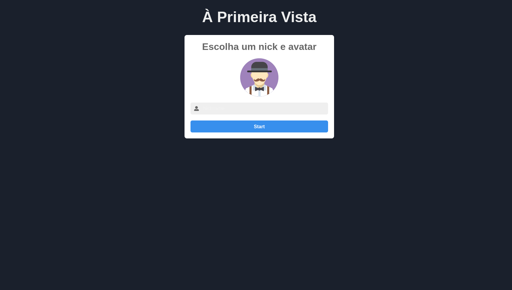
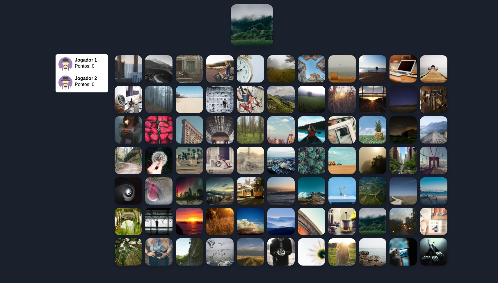
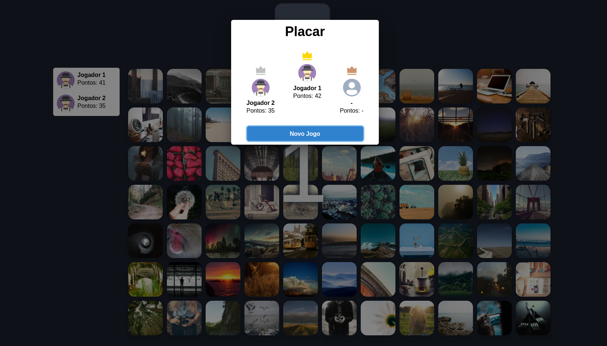

# Introduction

Caso você opte por testar a aplicação em produção, você pode utilizar o seguinte link: [https://lince-react-express-websockets.vercel.app/](https://lince-react-express-websockets.vercel.app/)

Se você tiver algum problema ou quiser testar na sua máquina, você pode seguir o passo a passo abaixo:

1. Clone o repositório.

2. Entre no subdiretório `/backend` e de o comando:

```shell
$ yarn
```

3. E inicie o servidor com o comando:

```shell
$ yarn start
```

4. Entre no subdiretório `/frontend` e de o comando:

```shell
$ yarn
```

5. E inicie a aplicação React com o comando:

```shell
$ yarn start
```

# Frontend

link da aplicação: [https://lince-react-express-websockets.vercel.app/](https://lince-react-express-websockets.vercel.app/)

## Regras do jogo

O jogo se baseia no jogo de tabuleiro com o nome **lince** e segue as mesmas regras:

- São necessários pelo menos 2 jogadores e todos jogadores devem estar **`prontos`** para a partida iniciar.
- A cada rodada um carta(imagem) será exibida.
- O jogador que clicar primeiro na imagem igual no tabuleiro, ganha 1 ponto.
- No final o jogador com mais pontos ganha o jogo.

## Imagens

### Escolha do nome e imagem do avatar



---

### Durante o jogo



---

### Resultado da partida



# Backend - Events

link da API: [https://lince-api-socket.herokuapp.com/](https://lince-api-socket.herokuapp.com/)

## Emit

---

### Event name: "start-game"

`Response format`

```json
{
  "currentImage": "http://images.com/image6.png",
  "isGameReady": true,
  "players": [
    {
      "id": "KIs5jdaf7ahbndq9h",
      "isReady": true,
      "points": 0,
      "name": "unknown",
      "image": "http://userImage.com/user.png"
    },
    {
      "id": "LTy19daAIUhndf2829",
      "isReady": true,
      "points": 5,
      "name": "user2574",
      "image": "http://userImage.com/user.png"
    },
    {
      "id": "Tps5j345ahbnGHJH9h",
      "isReady": true,
      "points": 15,
      "name": "user1342",
      "image": "http://userImage.com/user.png"
    }
  ],
  "images": [
    "http://images.com/image1.png",
    "http://images.com/image2.png",
    "http://images.com/image3.png",
    "http://images.com/image4.png",
    "http://images.com/image5.png",
    "http://images.com/image6.png",
    "http://images.com/image7.png",
    "http://images.com/image8.png"
  ]
}
```

---

### Event name: "update-game"

`Response format`

```json
{
  "currentImage": "http://images.com/image6.png",
  "isGameReady": true,
  "players": [
    {
      "id": "KIs5jdaf7ahbndq9h",
      "isReady": true,
      "points": 0,
      "name": "unknown",
      "image": "http://userImage.com/user.png"
    },
    {
      "id": "LTy19daAIUhndf2829",
      "isReady": true,
      "points": 5,
      "name": "user2574",
      "image": "http://userImage.com/user.png"
    },
    {
      "id": "Tps5j345ahbnGHJH9h",
      "isReady": true,
      "points": 15,
      "name": "user1342",
      "image": "http://userImage.com/user.png"
    }
  ]
}
```

---

### Event name: "update-players"

`Response format`

```json
{
  "currentImage": "http://images.com/image6.png",
  "isGameReady": true,
  "players": [
    {
      "id": "KIs5jdaf7ahbndq9h",
      "isReady": true,
      "points": 0,
      "name": "unknown",
      "image": "http://userImage.com/user.png"
    },
    {
      "id": "LTy19daAIUhndf2829",
      "isReady": true,
      "points": 5,
      "name": "user2574",
      "image": "http://userImage.com/user.png"
    },
    {
      "id": "Tps5j345ahbnGHJH9h",
      "isReady": true,
      "points": 15,
      "name": "user1342",
      "image": "http://userImage.com/user.png"
    }
  ]
}
```

---

### Event name: "finish-game"

`Response format`

```json
{
  "currentImage": "http://images.com/image6.png",
  "isGameReady": false,
  "players": [
    {
      "id": "KIs5jdaf7ahbndq9h",
      "isReady": false,
      "points": 0,
      "name": "unknown",
      "image": "http://userImage.com/user.png"
    },
    {
      "id": "LTy19daAIUhndf2829",
      "isReady": false,
      "points": 5,
      "name": "user2574",
      "image": "http://userImage.com/user.png"
    },
    {
      "id": "Tps5j345ahbnGHJH9h",
      "isReady": false,
      "points": 15,
      "name": "user1342",
      "image": "http://userImage.com/user.png"
    }
  ]
}
```

## On

---

### Event name: "is-ready"

`Request format`

```json
{
  "id": "KIs5jdaf7ahbndq9h",
  "isReady": true,
  "name": "unknown",
  "image": "http://userImage.com/user.png"
}
```

---

### Event name: "round-winner-user"

`Request format`

```json
{
  "userId": "KIs5jdaf7ahbndq9h",
  "image": "http://images.com/image5.png"
}
```

---

### Event name: "restart-game"

`Request format`

```plaintext
No content
```

---
